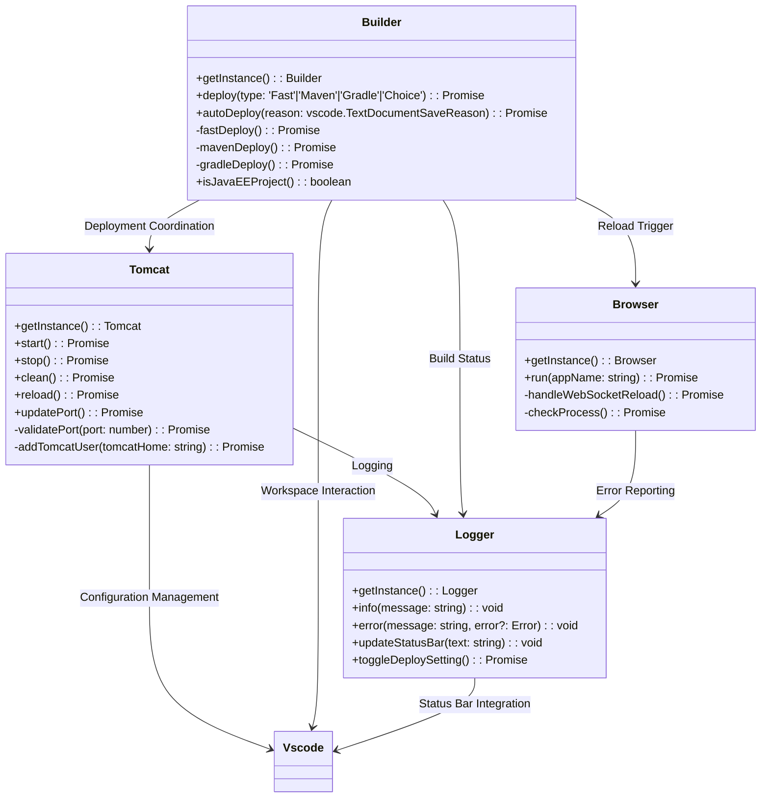
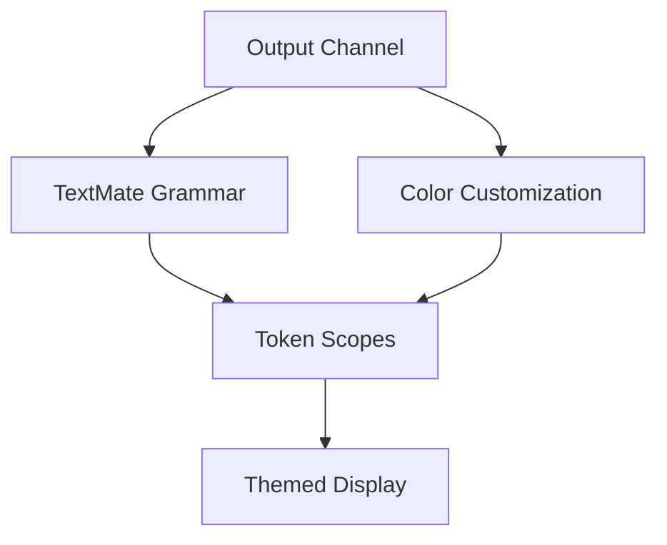

# Tomcat Extension Architecture

## Core Component Structure



## Component Responsibilities

### 1. Tomcat Manager
- **Server Lifecycle**: Start/stop using catalina.sh/bat scripts with proper JAVA_HOME and CATALINA_HOME [View Code](https://github.com/Al-rimi/tomcat/blob/main/src/utils/Tomcat.ts#L584-L647)
- **Port Management**: Validate port range (1024-49151), update server.xml connector with delay handling [View Code](https://github.com/Al-rimi/tomcat/blob/main/src/utils/Tomcat.ts#L470-L582)
- **Environment Detection**: Locate CATALINA_HOME and JAVA_HOME through config or user input [View Code](https://github.com/Al-rimi/tomcat/blob/main/src/utils/Tomcat.ts#L331-L436)
- **Clean Operations**: Remove non-essential webapps while preserving ROOT/docs/examples
- **Health Checks**: Verify running status through port scanning and netstat commands [View Code](https://github.com/Al-rimi/tomcat/blob/main/src/utils/Tomcat.ts#L303-L329)
- **User Management**: Auto-add admin user to tomcat-users.xml for custom manager access [View Code](https://github.com/Al-rimi/tomcat/blob/main/src/utils/Tomcat.ts#L649-L681)

### 2. Deployment Builder
- **Build Strategies**:
  - *Fast*: Uses memory list instead of temp and builds directly into webapps folder [View Code](https://github.com/Al-rimi/tomcat/blob/main/src/utils/Builder.ts#L328-L400)
  - *Maven*: Execute mvn clean package with enhanced error message parsing [View Code](https://github.com/Al-rimi/tomcat/blob/main/src/utils/Builder.ts#L402-L468)
  - *Gradle*: Run gradle war task with project-specific configuration [View Code](https://github.com/Al-rimi/tomcat/blob/main/src/utils/Builder.ts#L470-L501)
- **Project Detection**: Identify JavaEE projects through WEB-INF, Maven POM, or Gradle files [View Code](https://github.com/Al-rimi/tomcat/blob/main/src/utils/Builder.ts#L121-L159)
- **Auto-Deploy**: Trigger deployments on save (Ctrl+S/Cmd+S) based on configuration [View Code](https://github.com/Al-rimi/tomcat/blob/main/src/utils/Builder.ts#L247-L274)
- **Project Scaffolding**: Create new Maven webapp projects using archetype-webapp [View Code](https://github.com/Al-rimi/tomcat/blob/main/src/utils/Builder.ts#L276-L326)
- **Build Duration**: Logs and reports build completion time for performance tracking

### 3. Browser Controller
- **Cross-Platform Support**: Windows/Mac/Linux command variants for Chrome, Edge, Opera, Brave, Firefox, and Safari
- **Debug Protocol**: WebSocket integration for page reload without full browser restart [View Code](https://github.com/Al-rimi/tomcat/blob/main/src/utils/Browser.ts#L286-L334)
- **Process Management**: Detect running instances, kill hung processes on deployment
- **Smart Reload**: Maintain existing browser sessions when possible
- **Supported Browsers**:
  | Browser        | CDP Support | Auto-Reload | Process Management |
  |----------------|-------------|-------------|--------------------|
  | Chrome         | ✓           | ✓           | Advanced           |
  | Edge           | ✓           | ✓           | Advanced           |
  | Opera          | ✓           | ✓           | Advanced           |
  | Brave          | ✓           | ✓           | Advanced           |
  | Firefox        | Limited     | ✗           | Basic              |
  | Safari         | ✗           | ✗           | Basic              |

### 4. Logging System
- **Initializeation**: Editor button and status bar toggle for enabling/disabling auto-deploy [View Code](https://github.com/Al-rimi/tomcat/blob/main/src/utils/Logger.ts#L220-L244)
- **Multi-Channel Output**: VSCode output channel + status bar + toast notifications
- **Status Visualization**: Animated icons for active deployments
- **Error Handling**: Organized error messages for Java debugging and compilation
- **Syntax Coloring**: Enhanced output channel with Java-specific syntax highlighting
- **Toggle auto deploy**: Enable/disable auto-deploy on button click [View Code](https://github.com/Al-rimi/tomcat/blob/main/src/utils/Logger.ts#L199-L218)

#### Syntax Coloring Implementation

**Architecture**:


**Implementation Strategy**:

1. **Grammar Definition**:
   - Uses TextMate grammar format for tokenization
   - Custom scope name `source.tomcat-log`
   - Pattern matching for:
     - Timestamps `[01/01/2024, 12:00 PM]`
     - Log levels (INFO/DEBUG/ERROR)
     - Java file paths (`*.java`, `*.jsp`)
     - Build durations (`123ms`)
     - Error indicators (`^~~~` patterns)
     - Java syntax elements (classes, methods, annotations) [View Grammar](https://github.com/Al-rimi/tomcat/blob/main/syntaxes/tomcat-log.tmLanguage.json)

2. **Color Customization**:
   - Non-destructive merge with user themes
   - Semantic scope mapping [View Code](https://github.com/Al-rimi/tomcat/blob/main/src/ui/syntax.ts)
   - Theme-aware color selection:
     - 6 log level categories
     - 12 Java syntax types
     - 4 error severity levels

**Activation Flow**:
1. Extension registers `tomcat-log` grammar
2. Logger initializes output channel
3. `addSyntaxColoringRules()` merges customizations:
   ```typescript
   config.update('editor.tokenColorCustomizations', 
     { textMateRules: mergedRules },
     vscode.ConfigurationTarget.Global
   );
   ```
4. VS Code renderer applies scoped styles

**Key Features**:
- Preserves user theme settings through non-destructive merging
- Supports dark/light theme variants automatically
- Highlights build errors with red underline markers
- Differentiates Java types from framework classes
- Shows live deployment durations in green
- Formats XML config paths with italic style

**Integration Points**:
- Extends VS Code's output channel rendering
- Works with all built-in color themes
- Compatible with semantic highlighting API
- Exposes customization points through `contributes.grammars`