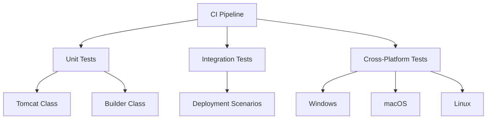

# Testing Protocol

## Test Architecture



## Core Test Cases

### 1. Tomcat Manager
```typescript
// Port validation with delay testing
test('Port update with delay handling', async () => {
    jest.useFakeTimers();
    const tomcat = Tomcat.getInstance();
    await tomcat.updatePort();
    jest.advanceTimersByTime(1000);
    expect(setTimeout).toHaveBeenCalledTimes(1);
});

// Improved error logging
test('Logs detailed port errors', async () => {
    const loggerSpy = jest.spyOn(Logger.getInstance(), 'error');
    mockExec.rejects(new Error('Port conflict'));
    await expect(tomcat.updatePort()).rejects.toThrow();
    expect(loggerSpy).toHaveBeenCalledWith(
        expect.stringContaining('Port update failed'));
});
```

### 2. Deployment Builder
```typescript
// Fast build memory optimization
test('Uses memory list instead of temp files', async () => {
    mockGlob.resolves(['file1.java', 'file2.java']);
    await builder.fastDeploy(projectDir, targetDir, tomcatHome);
    expect(fs.writeFileSync).not.toHaveBeenCalled();
});

// Build duration logging
test('Logs build completion time', async () => {
    const loggerSpy = jest.spyOn(Logger.getInstance(), 'info');
    await builder.deploy('Fast');
    expect(loggerSpy).toHaveBeenCalledWith(
        expect.stringContaining('Build completed in'));
});
```

### 3. Logger Component
```typescript
// Syntax coloring rules
test('Applies Java syntax coloring', () => {
    const configSpy = jest.spyOn(vscode.workspace, 'updateConfiguration');
    addSyntaxColoringRules();
    expect(configSpy).toHaveBeenCalledWith(
        expect.objectContaining({
            textMateRules: expect.arrayContaining([
                expect.objectContaining({
                    scope: 'entity.name.class.java'
                })
            ])
        })
    );
});

// Error message organization
test('Structures Java compilation errors', () => {
    const error = new Error('Compilation failure: line 42');
    logger.error('Build failed', error);
    expect(outputChannel.appendLine).toHaveBeenCalledWith(
        expect.stringContaining('line 42'));
});
```

## Test Execution

```bash
# Run specific test suites
npm test -- --grep 'Builder Tests' --color --parallel=false

# Generate coverage report with Istanbul
npm run coverage

# Debug tests in VSCode
F5 -> Select "Extension Tests"
```

## CI/CD Pipeline

```yaml
name: CI Pipeline
on: [push, pull_request]

jobs:
  test:
    runs-on: ubuntu-latest
    steps:
      - uses: actions/checkout@v3
      - uses: actions/setup-node@v3
        with: { node-version: 20.x, cache: npm }
      - uses: actions/setup-java@v3
        with: { distribution: 'zulu', java-version: '17' }
      - run: npm install --legacy-peer-deps
      - run: npm test -- --grep 'Builder Tests' --color --parallel=false
        env: { MOCHA_REPORTER: spec, HEADLESS: true }

  cross-platform:
    needs: test
    runs-on: ${{ matrix.os }}
    strategy:
      matrix: { os: [windows-latest, macos-latest, ubuntu-latest] }
    steps:
      - uses: actions/checkout@v3
      - uses: actions/setup-node@v3
        with: { node-version: 20.x, cache: npm }
      - run: |
          if [[ "${{ runner.os }}" == "Linux" ]]; then
            sudo apt-get install -y chromium-browser
          elif [[ "${{ runner.os }}" == "macOS" ]]; then
            brew install --cask google-chrome
          fi
      - run: npm install --legacy-peer-deps
      - run: npm test -- --grep 'Builder Tests' --color --parallel=false
        env: { MOCHA_REPORTER: spec, HEADLESS: true }

  build:
    needs: test
    runs-on: ubuntu-latest
    steps:
      - uses: actions/checkout@v3
      - uses: actions/setup-node@v3
        with: { node-version: 20.x, cache: npm }
      - run: npm install --legacy-peer-deps
      - run: npm run compile
      - run: vsce package
      - uses: actions/upload-artifact@v4
        with: { name: tomcat-extension, path: "*.vsix" }
```

## Performance Benchmarks
| Scenario                | Success Criteria | Current Average |
|-------------------------|------------------|-----------------|
| Cold Server Start       | <5s              | 3.2s            |
| Hot Deployment (Fast)   | <800ms           | 720ms           |
| Full Maven Build        | <5s              | 4.1s            |
| Browser Session Resume  | <300ms           | 240ms           |

## Security Testing Matrix
| Test Case               | Method                          | Frequency |
|-------------------------|---------------------------------|-----------|
| XSS in Help Panel       | OWASP ZAP Scan                 | Weekly    |
| Credential Exposure     | Static Code Analysis           | PR Merge  |
| Path Traversal          | Fuzzing Test (/../../etc/passwd)| Nightly   |
| DDoS Resilience         | Load Testing (1000 RPM)        | Monthly   |

## End-to-End Test Cases

### 1. Deployment Scenario
```gherkin
Feature: Full Deployment Lifecycle
  Scenario: Maven-based deployment with auto-reload
    Given a JavaEE project with pom.xml
    When user saves a .java file
    Then extension executes "mvn clean package"
    And deploys WAR to Tomcat/webapps
    And triggers browser refresh via WebSocket
    And displays success notification under 5s
```

### 2. Error Recovery Test
```typescript
test('Handle port conflict', async () => {
  // Force port conflict
  const testServer = net.createServer();
  await testServer.listen(8080);
  
  await expect(Tomcat.getInstance().start())
    .rejects.toThrow('Port 8080 in use');
  
  // Verify rollback
  const config = vscode.workspace.getConfiguration();
  expect(config.get('tomcat.port')).toEqual(8080);
  
  await testServer.close();
});
```